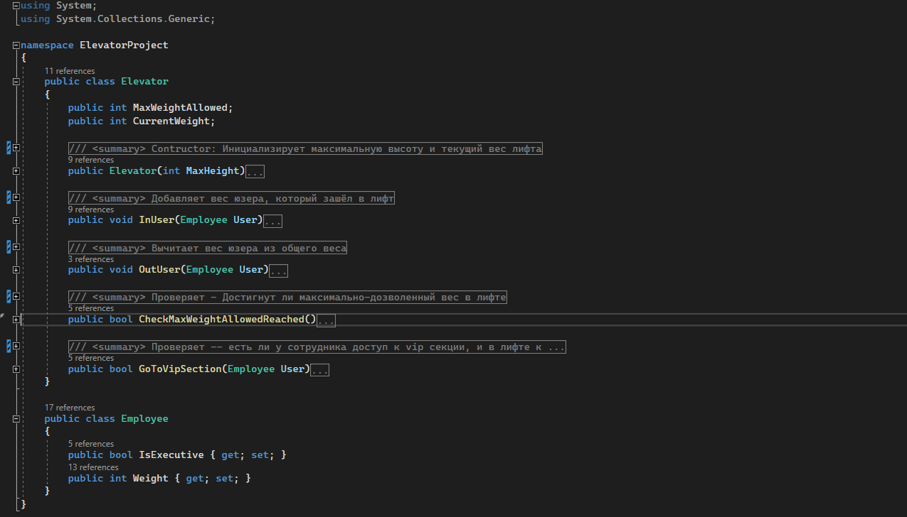
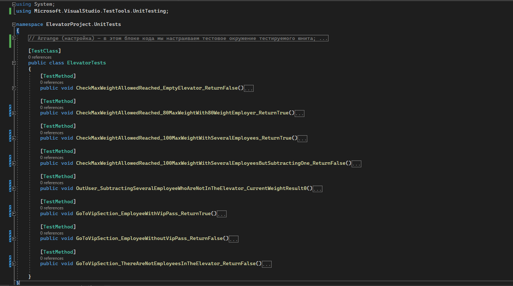
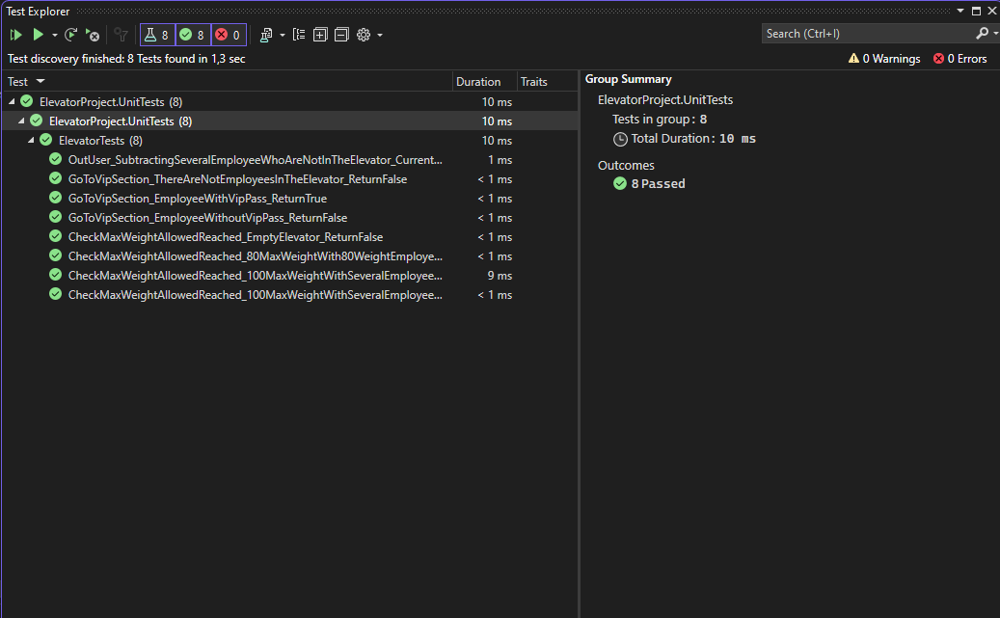

# UnitTest (ПР11)

### Описание

Простой юнит тест.

1. **Elevator** содержит **Elevator.cs** и **MainTest.cs**

В **Elevator.cs** есть класс Elevator который контролирует максимальный мес, который может выдержать лифт. Также содержит информацию о юзерах, которые внутри лифта, которые могут пойти в vip секцию. Также есть класс **Employee** который управляет весом, если у сотрудника есть доступ к vip секции.

**MainTest.cs** просто для выполнения программы в консоли

2. **ElevatorPoject.UnitTests** все юнит тесты здесь, внутри файла **ElevatorTests.cs**. Здесь находятся функции для тестов. 

Результат выполнения юнит теста:

